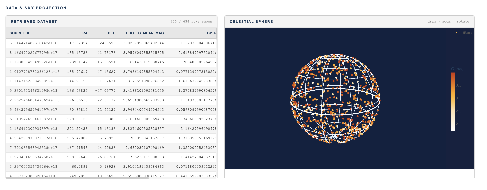

# Gaia Intelligent Query Pipeline
### Natural Language Interface for the ESA Gaia DR3 Dataset

**Guillem Masdemont Serra · Pietro Sestito · Plabon Shaha**  
*FRI Natural Language Processing Course 2026 — Advisors: Slavko Žitnik*

---

## Goal

The [ESA Gaia Data Release 3](https://archives.esac.esa.int/gaia) catalog contains ~1.8 billion stellar sources and represents the most detailed three-dimensional map of the Milky Way ever assembled. Accessing it requires ADQL, a SQL-based query language that is a significant barrier for non-specialists, students, and casual science enthusiasts. This project builds a **Retrieval-Augmented Generation (RAG) pipeline** that lets anyone query the Gaia database in plain English. You type a question like *"Show me red dwarfs near Barnard's star"* and the system handles the internal procedure to extract SQL from text and get a .csv file. 

---

## Pipeline (so far)

```
User natural-language query
        │
        ▼
┌─────────────────────┐
│   LLM Query Parser  │  Qwen2.5-7B-Instruct (vLLM)
│  (JSON intent)      │  Intent + coordinates + filters + columns
└──────────┬──────────┘
           │
           ▼
┌─────────────────────┐
│  Teacher Validator  │  Checks intent, coordinate ranges, columns,
│  (rule-based)       │  and provides the tool to call
└──────────┬──────────┘   (up to 3 retries with error feedback)
           │
           ▼
┌─────────────────────┐
│   ADQL Builder      │  Deterministic intent → ADQL translation
│                     │  (cone search, JOIN, ORDER BY, null guards…)
└──────────┬──────────┘
           │
           ▼
┌─────────────────────┐
│   Cost Judge        │  Check if the query is feasible or too big
│  cheap/mod/exp/danger│  Blocks dangerous queries, auto-optimises
└──────────┬──────────┘  (random sampling, cone shrink, TOP cap)
           │
           ▼
┌─────────────────────┐
│  Gaia TAP Executor  │  We send a async job to astroquery
│  (retry + backoff)  │
└──────────┬──────────┘
           │
           ▼
┌─────────────────────┐
│   HTML Report       │  Present results in Sky map · Celestial sphere 
│   (display_html.py) │  Histograms · Colour-magnitude diagram · Stats cards
└─────────────────────┘
```

## Example: "Provide me the brightest stars"

The pipeline parses the query, builds a validated ADQL query, confirms the cost is cheap, fetches 634 sources from Gaia DR3, and produces a full visual report.




## Future directions

- **Evaluation harness** — Automated scoring of generated ADQL against the ground-truth queries in `src/dataset/queries_1000.csv` (simple / medium / complex tiers).
- **Retrieval-augmented generation** — Embed Gaia DR3 documentation and schema descriptions into a vector store; retrieve relevant context before LLM parsing to improve accuracy on complex queries.
- **Conversational interface** — Multi-turn dialogue so users can iteratively refine their query ("now filter only stars hotter than 6000 K").
- **Gaia DR4 readiness** — Extend the schema to handle the projected 100+ observations per source in DR4 (expected late 2026) and the petabyte-scale data volume.
- **Result summarisation** — After query execution, use an LLM to generate a plain-English interpretation of the returned data ("You retrieved 634 of the brightest stars in the sky; the bluest ones are massive main-sequence stars while the reddest are cool giants").
- **Broader intent coverage** — Add intents for period-folding of variable star light curves, isochrone fitting, and cross-matching against external catalogs (2MASS, SDSS).

## Repository layout

```
src/
  astronomy_query.ipynb   # Main pipeline notebook
  display_html.py         # HTML report generator
  gaia_report.html        # Example report (brightest stars query)
  dataset/
    queries_100_v2.csv    # Benchmark: 100 NL→ADQL pairs (simple/medium/complex)
    queries_1000.csv      # Extended benchmark set
report/
  report.tex              # Project interim report (LaTeX)
  report.pdf
docs/
  sky_scatter.png         # Extracted visualisation examples
  colour_histogram.png
  statistical_plots.png
```
