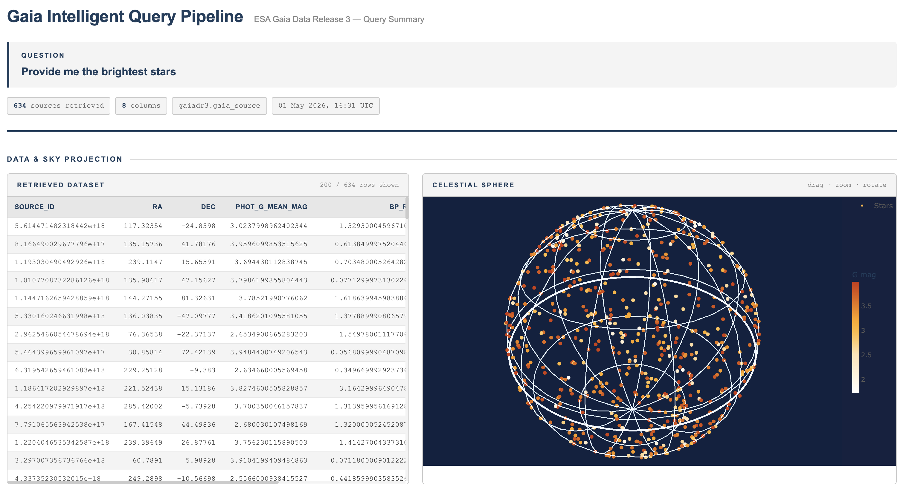
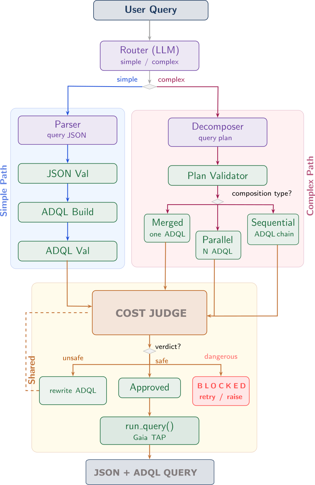
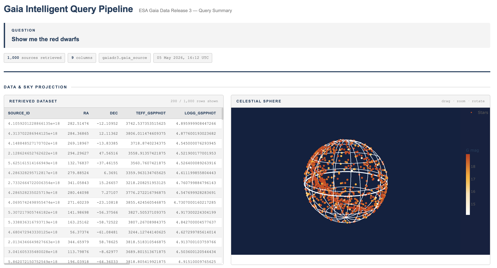
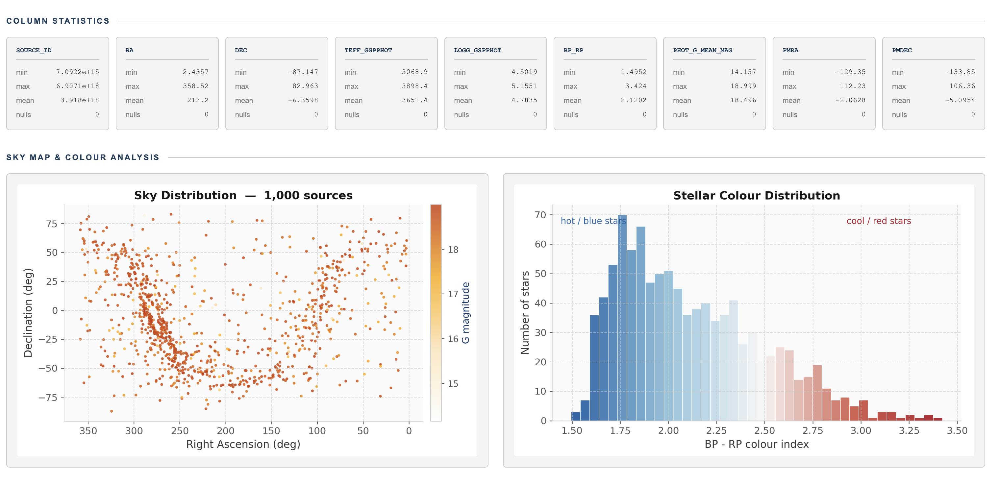

# Query Generation for the Gaia DR3 Database
### Natural Language Interface for the ESA Gaia DR3 Catalogue

**Guillem Masdemont Serra · Pietro Sestito · Plabon Shaha**  
*FRI Natural Language Processing Course 2026*, *Advisor: Aleš Žagar*

*Erasmus Mundus Joint Master in Artificial Intelligence — 2nd Semester, University of Ljubljana*

<p align="center">
  <a href="LICENSE"></a>
  
  
  
  
  
  
</p>

---

## Overview

The [ESA Gaia DR3](https://archives.esac.esa.int/gaia) catalogue contains ~1.8 billion stellar sources and represents the most detailed three-dimensional map of the Milky Way ever assembled. Querying it requires **ADQL** (Astronomical Data Query Language), a SQL dialect that is a significant barrier for non-specialists.

This project builds a **natural language → ADQL pipeline** powered by a 7-billion-parameter LLM (Qwen2.5-7B-Instruct) that lets anyone query the Gaia database in plain English:

> *"Find me red dwarfs near Barnard's Star"*  
> *"Plot an HR diagram for the 700 nearest stars"*  
> *"Show variable stars in the Orion Nebula"*

The system parses the intent, builds a validated and cost-checked ADQL query, executes it against the Gaia TAP server, and returns an interactive HTML report with sky maps, colour-magnitude diagrams, and statistical summaries.

**Example output** — query: *"Provide me the brightest stars"*:



---

## Important: Running Requirements

> **This pipeline cannot be run locally.** It requires:
> - An NVIDIA GPU with CUDA 12.4 (≥ 24 GB VRAM recommended for Qwen2.5-7B)
> - The Qwen2.5-7B-Instruct model pre-downloaded via HuggingFace
> - An Apptainer/Singularity container (see `src/docker/vllm.def`)
> - Access to the ARNES HPC cluster (or equivalent SLURM infrastructure)
>
> See the [Running on HPC](#running-on-the-arnes-hpc) section below.

---

## Pipeline Architecture

<p align="center">
  
</p>

### Simple vs. Complex path

| Path | When | Strategy |
|------|------|----------|
| **Simple** | Single region, single analysis | Parse → single ADQL → execute |
| **Complex** | Multiple regions or sequential dependencies | Decompose → execution plan → run merged / parallel / sequential steps |

The complex path supports three composition strategies:
- **Merged** — combines multiple analyses into one ADQL (most efficient)
- **Parallel** — runs N independent queries on different regions
- **Sequential** — feeds source IDs from step N into step N+1 (e.g., cross-matching)

---

## Supported Query Types

The parser recognises eight intent types:

| Intent | Example |
|--------|---------|
| `cone_search` | "Find stars near the Pleiades within 2 degrees" |
| `hr_diagram` | "Plot an HR diagram for the 700 nearest stars" |
| `stellar_population` | "Find red dwarfs with temperature below 4000 K" |
| `variability_search` | "Show variable stars in Orion" |
| `velocity_kinematics` | "Find stars with high proper motion near the galactic centre" |
| `cross_match` | "Match stars in Omega Centauri with astrophysical parameters" |
| `nearest_neighbor` | "What are the 50 closest stars to the Sun?" |
| `sky_wide_superlative` | "Find the 1000 brightest stars in the whole sky" |

---

## Evaluation Results

Tested on a custom benchmark of 40 NL→ADQL pairs covering four intent types:

| Metric | Score |
|--------|-------|
| Exact match | 28% |
| Equivalent intent | 54% |
| Token F1 | ~0.62 |
| Structural similarity | ~0.71 |

See `src/dataset/gaia_eval_dataset.csv` for the benchmark and `src/dataset/eval_resultss.csv` for per-query results.

---

## Repository Layout

```
.
├── requirements.txt             # All Python dependencies (see note above)
├── report/
│   ├── report.pdf               # Final project report
│   └── report.tex               # LaTeX source
├── assignments/                 # Course assignment submissions (independent)
└── src/
    ├── README.md                # Source code guide (start here for the code)
    ├── display_html.py          # Standalone HTML report generator
    ├── gaia_report.html         # Example output: brightest stars query
    ├── dataset/
    │   ├── gaia_eval_dataset.csv        # NL→ADQL benchmark (40 pairs, 4 intents)
    │   ├── eval_resultss.csv            # Evaluation results per query
    │   └── generated_dataset.ipynb      # Notebook used to generate the dataset
    ├── docker/
    │   ├── vllm.def             # Apptainer container build recipe (CUDA 12.4)
    │   └── vllm.sh              # SLURM batch script for ARNES HPC
    ├── output/
    │   ├── displayed_html/      # Example HTML reports (Q1–Q4)
    │   └── pipeline_outputs/    # JSON execution logs for ~16 sample queries
    └── pipeline/
        ├── main.ipynb           # Entry point: run a query interactively
        ├── evaluate_pipeline.ipynb  # Evaluation notebook
        ├── pipeline.py          # Top-level router entry point
        ├── config.py            # Environment setup and shared constants
        ├── model.py             # vLLM model loader (Qwen2.5-7B-Instruct)
        ├── router.py            # Query complexity classifier
        ├── parser.py            # LLM intent parser + ADQL builder
        ├── simple_pipeline.py   # Simple path orchestrator
        ├── complex_pipeline.py  # Complex path orchestrator
        ├── cost_judge.py        # Cost evaluator and auto-optimiser
        ├── eval_metrics.py      # BLEU, token-F1, structural similarity
        └── display_html.py      # Interactive HTML report generator
```

---

## Running on the ARNES HPC

### 1. Build the container (once)

```bash
# On the HPC login node
cd /d/hpc/projects/onj_fri/no-language-processors-v2
apptainer build --fakeroot vllm.sif src/docker/vllm.def
```

### 2. Download the model (once)

```bash
apptainer exec --nv vllm.sif \
    huggingface-cli download Qwen/Qwen2.5-7B-Instruct \
    --cache-dir /d/hpc/projects/onj_fri/no-language-processors-v2/hf_cache
```

### 3. Submit the job

```bash
sbatch src/docker/vllm.sh
```

The job starts a Jupyter Lab server. Watch the SLURM output log for the SSH tunnel command:

```
SSH tunnel command (run on your laptop):
  ssh -N -L <PORT>:<NODE>:<PORT> <username>@hpc-login.arnes.si
Then open: http://localhost:<PORT>
```

### 4. Run a query

Open `src/pipeline/main.ipynb` in Jupyter Lab and run all cells. The entry point is:

```python
from pipeline import routed_pipeline

result = routed_pipeline("Find 500 bright stars near the Pleiades cluster")
# result['results'] → dict of pandas DataFrames
# result['output_json'] → execution metadata and generated ADQL
```

---

## Example Output

The pipeline for *"Find red dwarfs near Barnard's Star"* generates a validated ADQL query, fetches sources from Gaia DR3, and produces:




Pre-generated example reports are in `src/output/displayed_html/`.

---

## Authors & Acknowledgements

We acknowledge and thanks the guidance of Prof. Mercè Romero-Gómez, researcher at the Institute of Cosmos Sciences of the University of Barcelona (ICCUB) and member of the ESA Gaia Data Processing and Analysis Consortium (DPAC).

Advisor: **Aleš Žagar** (FRI, University of Ljubljana)  
Course: NLP Course 2025–2026
